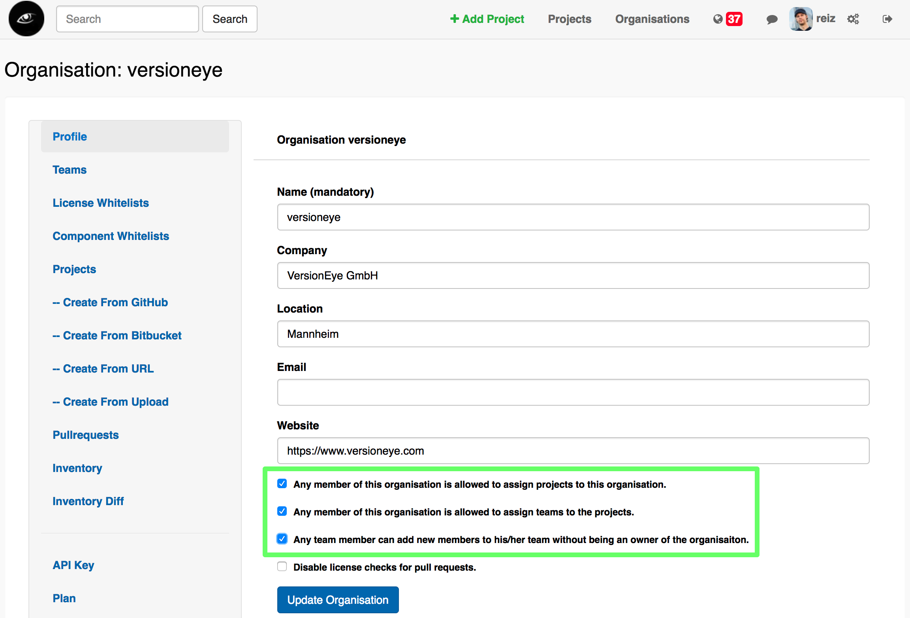

# VersionEye User Guide

This user guide explains how to use the VersionEye software as a user. 
If you wanna now how to setup the software you should check out the [ops_contrib](https://github.com/versioneye/ops_contrib) repository.

- [Users](#users)
- [Organisations](#organisations)
- [Teams](#teams)
- [Permissions inside of an organisation](#permissions-inside-of-an-organisation)

## Users

Everybody can sign up for free at [VersionEye.com](https://www.versioneye.com). Every user in the system has a: 

 - Username
 - Email
 - Password
 - List of organisations
 
After a successful signup of a new user, a new organisation is created to which the user is assigned to. The name of the new organisation follows always this pattern `#{username}_orga`.

If the software is running in `enterprise` mode, it can be configured that way that only admins of the system can create new organisations. 

## Organisations

An organisation is the entity for a work group. This entities are bound to an organisation:

 - Projects
 - Teams (users)
 - License whitelists
 - Component whitelists
 - Open Source Inventory List 
 - Subscription
 - API Key 
 - Billing Address

The entities above are never bound to a user directly. That has the advantage that the owernship can be transfered very easily. A user can be member in many organisations. 

In the main menu there is a point for "organisations". 
By clicking on that menu a list of all organisations is returned there the user is a member of. Here is an example: 

The first element in the list is a link to create a new organisation. 

## Teams

A team is a collections of users. An organisation can have multiple teams. 

There is a N to N relationship between projects and teams. 
That means that a project can be assigned to multiple teams and a team can be 
assigned to multiple projects. The notifications are configured on a team level. 
Each team can decide in which kind of notifications they are interested and 
on which week day they want to receive the notifications. 

The team(s) can be assigned to a project in the the project settings tab. 

## Permissions inside of an organisation

By default every organisation has a team called `Owners`. 
The members of that team are the admins of the organisation. 
So think twice who you are adding to the `Owners` team.
The user who created the organisation is initially part of the `Owners` team. 
The `Owners` team can **not** be deleted! 

Members of the `Owners` team have read & write access to: 

 - Teams
 - License whitelists
 - Component whitelists
 - Projects

They can create new teams and invite new users to a team. 
They can create new license whitelists and add & remove licenses to/from a license whitelist. 
Same is true for component whitelists. And they can create & delete projects in the organisation. 

The members of the `Owners` team have full access to the API section of the organisation. 
That means they can see the two API keys of the organisation and they can generate new API keys. 

In the cloud version, they are the only ones who have access to the subscription settings of the organisation. 
That means they can upgrade and downgrade the paid subsciption, they can update the credit card information, 
edit the billing address and they have full access to the payment history. 

### Regular users

Regular users in an organisation are users who are member of at least one team of the organisation, 
but they are not member of the `Owners` team. They have only read access to this entities: 

 - Teams
 - License whitelists
 - Component whitelists
 - Projects

They can see all teams and their members, but they can not create new teams and they can not add or remove team members. 
The can see all license whitelists and the licenses on it but they can not create new ones and they can not add or remove elements to/from a license whitelist. 
Same is true for component whitelists. And they can not create new projects. 

They don't have access to the API section of the organisation. That means they can not see the API keys of the organisation. 

They can change the project settings of the projects, which are assigned to their teams and of course they receive the email notifications for that. 

### Exceptions

Exceptions to the rules described above can be made in the profile section of the organisation. 
Currently there are 3 exceptions which the Owners of the organisation can configure. 

 - Any member of this organisation is allowed to assign projects to this organisation.
 - Any member of this organisation is allowed to assign teams to the projects.
 - Any team member can add new members to his/her team without being an owner of the organisaiton.

Here is a screenshot how it looks on the UI:

