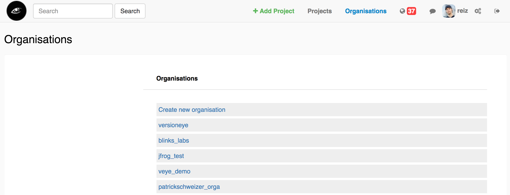
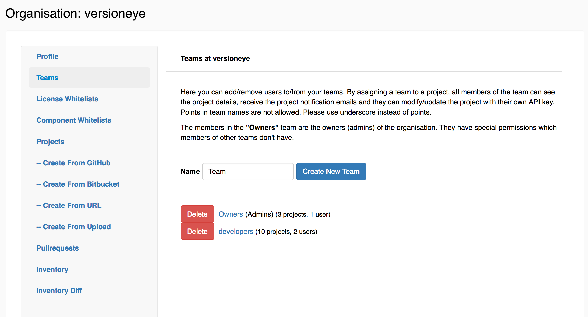
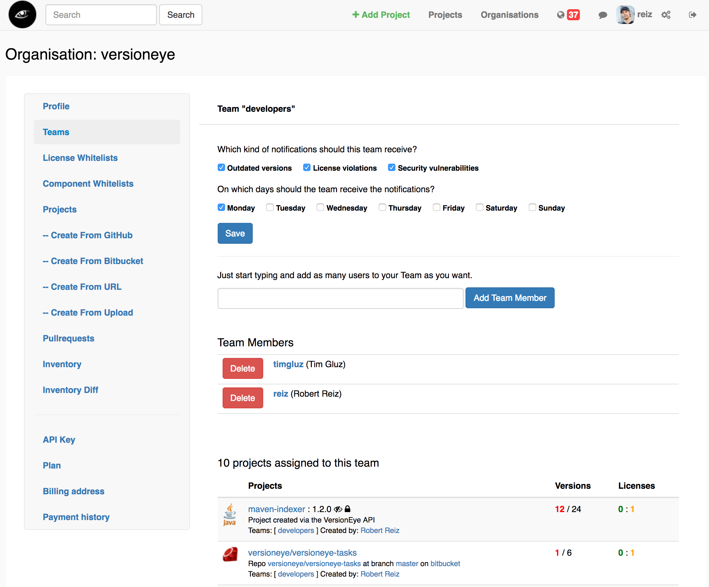
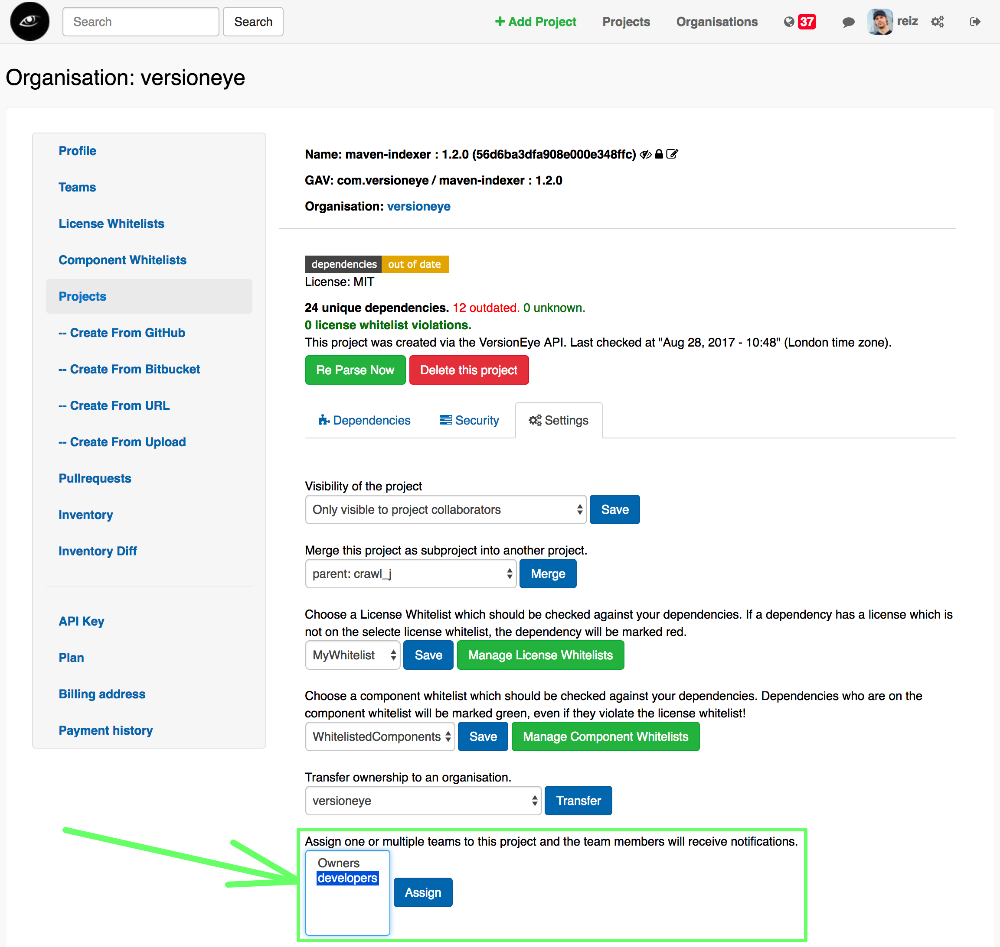

# VersionEye User Guide

This user guide explains how to use the VersionEye software as a user. 
If you wanna now how to setup the software you should check out the [ops_contrib](https://github.com/versioneye/ops_contrib) repository.

## Users

Everybody can sign up for free at [VersionEye.com](https://www.versioneye.com). Every user in the system has a: 

 - Username
 - Email
 - Password
 - List of organisations
 
After a successful signup of a new user, a new organisation is created to which the user is assigned to. The name of the new organisation follows always this pattern `#{username}_orga`.

If the software is running in `enterprise` mode, it can be configured that way that only admins of the system can create new organisations. 

## Organisations

An organisation is the entity for a work group. This entities are bound to an organisation:

 - Projects
 - Teams (users)
 - License whitelists
 - Component whitelists
 - Open Source Inventory List 
 - Subscription
 - API Key 
 - Billing Address

The entities above are never bound to a user directly. That has the advantage that the owernship can be transfered very easily. A user can be member in many organisations. 

In the main menu there is a point for "organisations". 
By clicking on that menu a list of all organisations is returned there the user is a member of. Here is an example: 

The first element in the list is a link to create a new organisation. 

## Teams

A team is a collections of users. An organisation can have multiple teams. 

There is a N to N relationship between projects and teams. 
That means that a project can be assigned to multiple teams and a team can be 
assigned to multiple projects. The notifications are configured on a team level. 
Each team can decide in which kind of notifications they are interested and 
on which week day they want to receive the notifications. 

The team(s) can be assigned to a project in the the project settings tab. 

## Permissions inside of an organisation

By default every organisation has a team called `Owners`. 
The members of that team are the admins of the organisation. 
So think twice who you are adding to the `Owners` team.
The user who created the organisation is initially part of the `Owners` team. 
The `Owners` team can **not** be deleted! 

